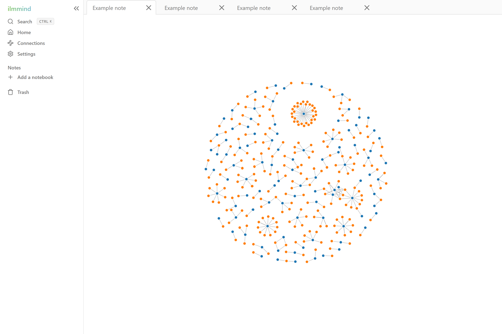

# ilmmind 📝🖌️

The ultimate Islamic note-taking app. Capture and view your thoughts, reflections and notes and their connections any time, anywhere.

ilmmind combines the handwritten and text note capabilities of apps like GoodNotes and OneNote with the graph view functionality of Obsidian, a unique combination not available in any apps currently.

This project is a continuation and 'complete' version of an earlier project I started, which is linked here: [https://github.com/amin-aggag/drawing-notepad/](https://github.com/amin-aggag/drawing-notepad).

Note editor:

Connections feature (graph view):

## Technologies used

 Tauri (Rust)

 React

 TypeScript

 Vite

I designed the code to be **reusable**, **maintainable**, **clean** and easy to add features to by using React design patterns including custom hooks and the use of `useContext()` for state management throughout the component tree as well as code organisation principles like SOLID principles and Ousterhout deep modules.

Cursor was used in this repository to speed up development, however I still architected all of the high level system design decisions, all of the code style rules and the code organisation file-by-file. This is to prevent bad quality code from entering the codebase and to keep the codebase maintainable in the long-term, whilst still making development quicker.

None of this code came from any course or YouTube tutorial. This project was made on my own.

## Features

🎨 Various colors to choose from

🤚 A moveable canvas to draw on (two fingers or trackpad gestures to pan)

↩️ Undo and redo functionality

👆 Touch and mouse support

## Planned features

🖊️ Various pens sizes

📁 File system of notes/drawings

💾 Saving notes and importing/exporting 

📄 Custom canvas size

↗️ Zooming canvas in and out

🖼️ Sleek and undistracting UI design (the images are from a previous version of ilmmind)

## Running the app locally

Clone this repository: `git clone <repository-link>`

Run `npm i`

Run `npm run tauri dev`

The app should now be running locally on your machine!

Alternatively, to use only the front-end in a web browser, you can go to [http://localhost:1420](http://localhost:1420) after running the above command.

